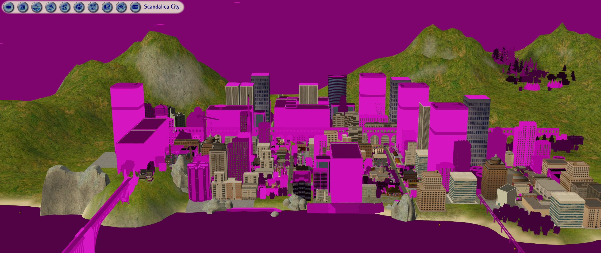
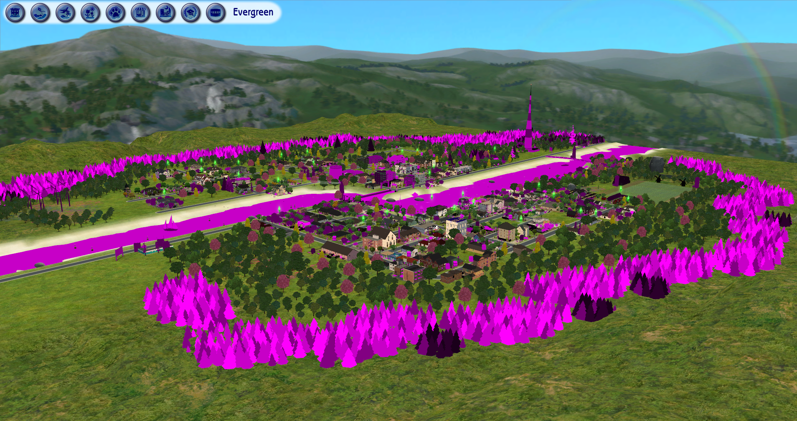
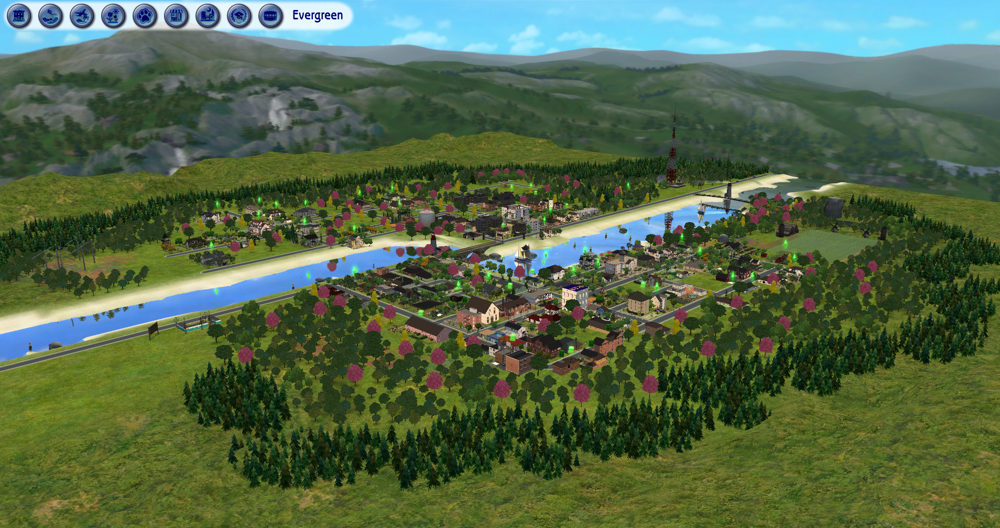
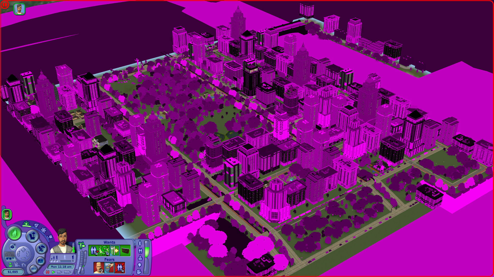
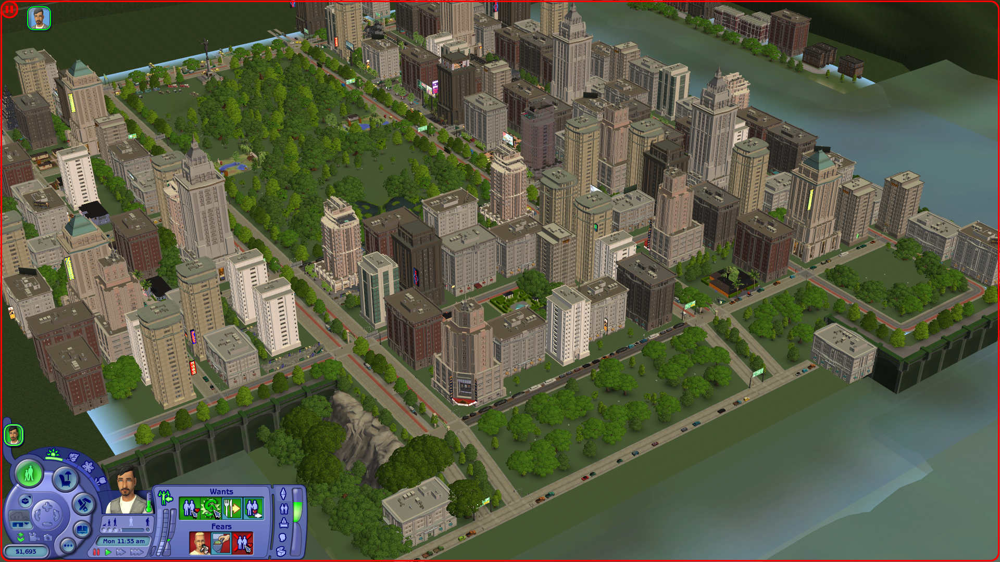
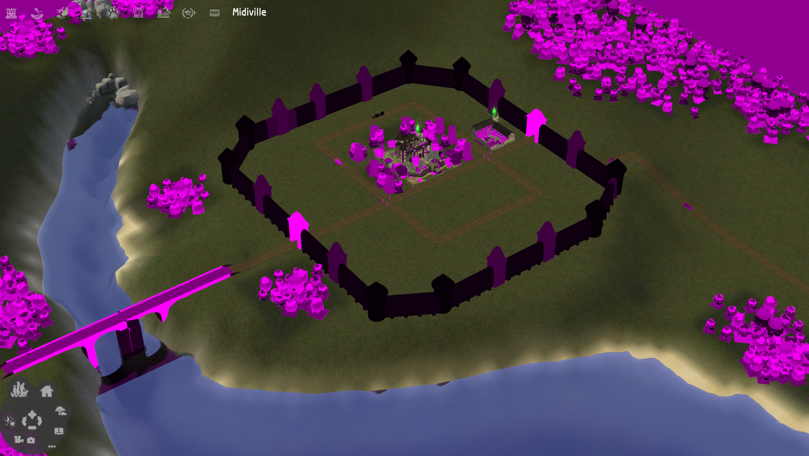
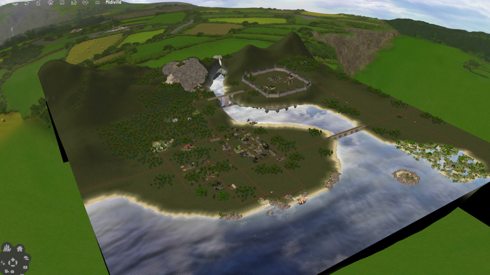
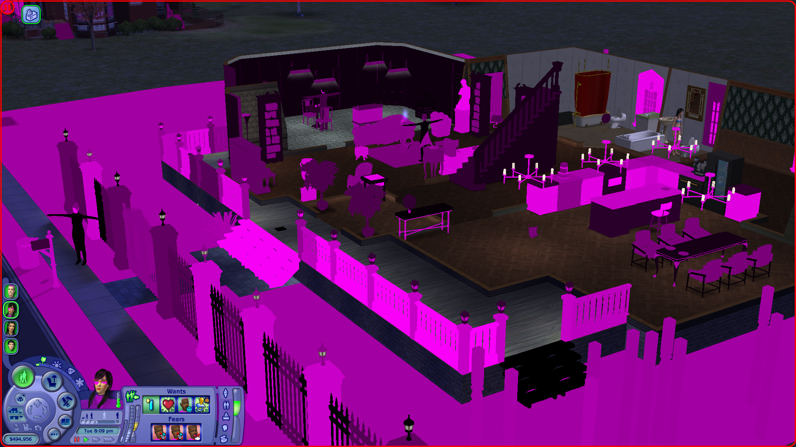
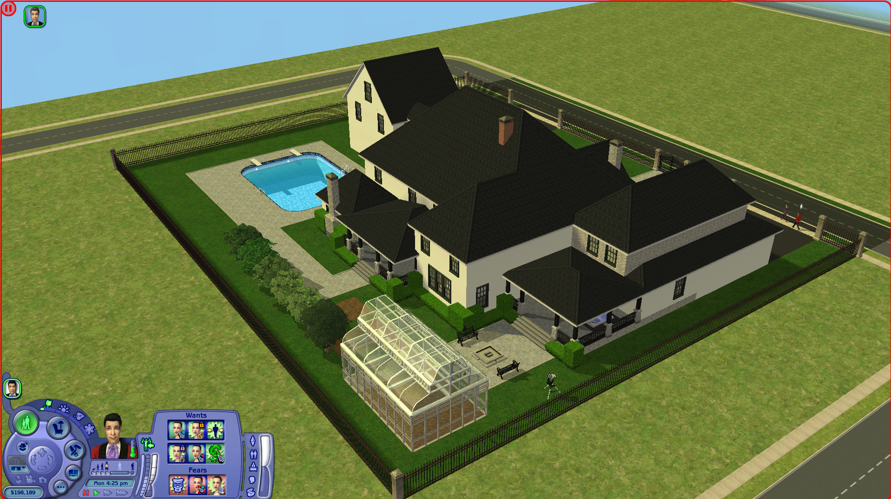

# TS2 Memory Address Cap Remover
## About
An experimental patch for The Sims 2 based on the findings of my MSc [dissertation](A%20Recipe%20For%20Pink%20Soup.pdf), which (hopefully) fixes the issue of the 'pink soup' bug that frequently
occurs when playing the game on 64-bit versions of Windows.

Made for use with The Sims 2: Ultimate Collection with the 4 GB patch applied, using either [Sims2RPC](https://modthesims.info/d/648220/sims2rpc-modded-sims-2-launcher-for-mansion-and-garden.html)
or [Ultimate ASI Loader](https://github.com/ThirteenAG/Ultimate-ASI-Loader).

Those playing the Legacy Collection should use [TS2Extender](https://github.com/LazyDuchess/TS2-Extender), which incorporates the fix seen in this mod.

## Explanation
Despite the common belief that the 'pink soup' bug is related to texture memory calculation mishaps, its cause is actually due to an apparent failsafe that prohibits shaders
being linked to objects that are stored in memory at addresses above a certain value &mdash; a limitation of the 32-bit architecture The Sims 2 was developed for.

The maximum value of an unsigned 32-bit integer is 4,294,967,295, which is equivalent to approximately 4GB. Because of this constraint, address space was split 50/50 on 32-bit
Windows, with 2GB reserved for the kernel and the remaining 2GB for applications.

To prevent the game dangerously operating on data within kernel space, a check was implemented in a function (found at address `0x00D947F3` in the game's binary) that
tests whether the address of the object being processed during shader linkage is greater than `0x7FFFFFFF` (~2GB), and if so, forces the process to fail, culminating in
the appearance of the 'pink soup'.

This presents an issue when the game is patched to be Large Address Aware (also known as a 4GB patch) on modern 64-bit Windows, as the range of addressable memory is
expanded from `0x00000000`&ndash;`0x7FFFFFFF` to `0x00000000`&ndash;`0xFFFFFFFF`. Although this allows the game to allocate data into a larger range of addresses
(and it is freely doing so), the built-in failsafe prohibits it from fully processing anything stored here.

This plugin alleviates these restrictions, with two separate versions offering similar functionality, but differing in their implementation:
- Version 1: The more 'brute-force' method, which patches out the failsafe entirely &mdash; the game will perform the same operations on an object stored above `0x7FFFFFFF`
  as it would on an object stored at addresses of `0x7FFFFFFF` or below.
- Version 2: A potentially 'safer' option that keeps the failsafe intact, but raises the point at which it triggers to addresses above `0xCFFFFFFF` (~3.5GB memory usage).
  *In theory*, this should allow the 'pink soup' to act as an indicator of high memory usage when it appears, giving you enough time to restart the game before it inevitably
  crashes.

For a less technical breakdown of the issue, please see [here](https://www.tumblr.com/spockthewok/814788698084409345/explaining-the-pink-soup-in-laymans-terms).

## Things To Note
- Even though the annoyance of the 'pink soup' has effectively been eliminated, it is important to keep in mind that this does not mean it is now possible to play with
  a greater amount of custom content, or with highly decorated neighbourhoods/lots etc.

  Because the game is a 32-bit program, it is still architecturally limited to a maximum address of `0xFFFFFFFF` if patched to be Large Address Aware (translating to
  a maximum memory usage of around 4GB), regardless of the presence of these checks or the hardware or operating system it is being played on. As mentioned previously,
  the game will simply crash when this limit is reached, which may lead to save corruption if this happens at an inopportune moment, such as during saving/loading.
- An identical piece of failsafe logic is found within the function at address `0x00D948B6`. During my extensive debugging of the game for this project, this set of checks was
  never triggered, but it is possible that they may be executed, causing the 'pink soup' as a result. Code has been left within the v1 plugin to remove these checks but has
  been commented out, as it is hard to test due to it never being hit.
- This was my first attempt at both writing code in C++, and creating a plugin that hooks into a program &mdash; I would be very surprised if I hadn't made a mistake somewhere
  or done something in a suboptimal manner.

## Installation
**For Sims2RPC**

1. Download one of the two versions of the plugin found under the [Releases](https://github.com/spockthewok/TS2MemCapRemover/releases) section of this repository.
2. Move the downloaded plugin to the `\TSBin\mods` directory, found under wherever you have the Sims 2 installed to. For example, on my machine, the plugin would be moved to:

   `E:\Games\The Sims 2\Fun with Pets\SP9\TSBin\mods`

**For Ultimate ASI Loader**

1. Download Ultimate ASI Loader from [here](https://github.com/ThirteenAG/Ultimate-ASI-Loader/releases/download/Win32-latest/dsound-Win32.zip).
2. Extract `dsound.dll` from the zip file and place it in the game's `\TSBin` directory. On my machine, it would go here:

   `E:\Games\The Sims 2\Fun with Pets\SP9\TSBin`
3. Download one of the two version of this plugin and move it to the same `\TSBin` directory Ultimate ASI Loader was extracted to.

## Community Testimonials
| Before | After |
| :----: | :---: |
|  |  |
|  |  |
|  |  |
|  |  |
|  |  |

**Tumblr Success Stories**

[12Raben](https://www.tumblr.com/12raben/814509102470496256/one-of-the-reasons-why-i-stopped-playing)

[Blissful-Indigo](https://www.tumblr.com/blissful-indigo/814713731385819136/my-experience-with-spockthewoks-pink-soup-patch)

[EJ Sims](https://www.tumblr.com/ejsims/814901132709249024/in-the-10-years-since-ive-been-playing-ts2-again)

[eleysims](https://www.tumblr.com/eleysims/814589060560650240)

[LordCrumps](https://www.tumblr.com/lordcrumps/814605472484229120)

[nerianasims](https://www.tumblr.com/nerianasims/814812643614441472/please-dont-be-pink-please-dont-be-pink-please)

## Thanks
[LazyDuchess](https://github.com/LazyDuchess), whose hooking library and various TS2 plugins I used as the basis/template for my code.

[TeaAddictYT](https://github.com/TeaAddictYT), for kindly gathering the before/after pictures seen above.

Special thanks also goes to The Sims 2 community as a whole &mdash; not only for producing many of the resources and tools necessary to complete this project,
but also for being so welcoming and providing such positive feedback towards my work.
